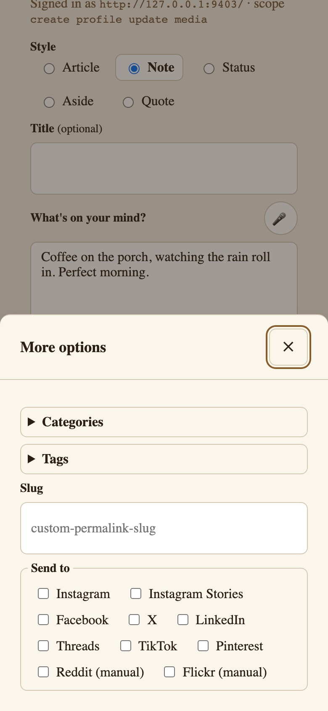
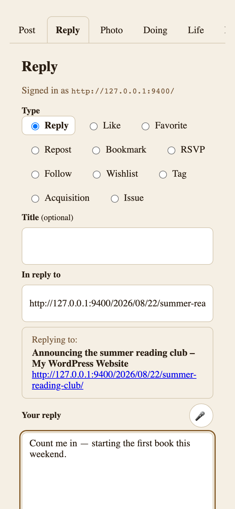
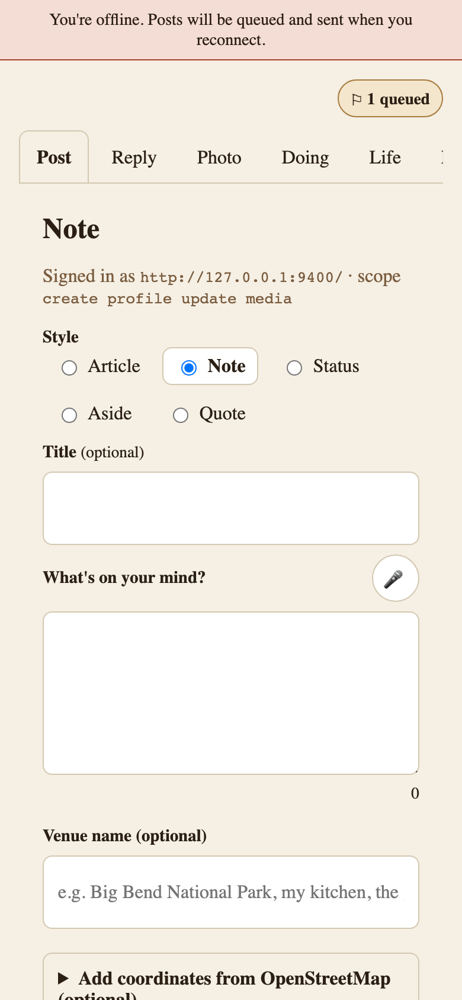

# Outpost

[](https://github.com/courtneyr-dev/outpost/actions/workflows/ci.yml)
[](https://github.com/courtneyr-dev/outpost/releases/latest)
[](LICENSE)

> *Post from your outpost. Reach your people everywhere.*

Mobile-first Progressive Web App composer for IndieWeb POSSE workflows. Requires WordPress 6.5+ and PHP 8.2+; tested up to WordPress 7.1.

**Status:** version 1.0.6 (Plugin Check clean on WordPress 7.1). Not yet listed on WordPress.org — install from GitHub.

## User documentation

**User documentation:** [Read the complete Outpost documentation](https://courtneyr-dev.github.io/outpost/)

Key pages:

- [Installation](https://courtneyr-dev.github.io/outpost/installation/) — GitHub install plus the required IndieAuth and Micropub plugins.
- [Getting started](https://courtneyr-dev.github.io/outpost/getting-started/) — sign in, post a note from your phone, install to your home screen.
- [Settings](https://courtneyr-dev.github.io/outpost/settings/) — composer defaults, API keys, appearance, OAuth connections.
- [Troubleshooting](https://courtneyr-dev.github.io/outpost/troubleshooting/) — managed-host auth issues, offline queue, dependency notices.
- [Privacy and data](https://courtneyr-dev.github.io/outpost/privacy-and-data/) — what's stored and which services are contacted.

The docs site builds from [`docs/`](docs/) with Astro Starlight — see [docs/MAINTAINING.md](docs/MAINTAINING.md) to update it.

## What this is

Outpost is a WordPress plugin that ships a mobile-first PWA composer at `/post` (configurable). It's optimised for the post shapes IndieWeb people actually publish — quick notes, replies, likes, photos, and life-tracking entries — with one-tap syndication chips that default to **on** for every configured destination.

Every kind that [Post Kinds for IndieWeb](https://github.com/courtneyr-dev/post-kinds-for-indieweb) registers is postable from the composer, grouped into six tabs:

| Tab | Kinds |
|---|---|
| Post | note, status, aside, quote, article |
| Reply | reply, like, favorite, repost, bookmark, RSVP, follow, wishlist, tag, acquisition, issue |
| Photo | photo and galleries |
| Doing | listen, watch, read, play, game, jam, checkin, eat, drink, exercise, craft, event, review, video, audio |
| Life | mood, weather, sleep, trip, itinerary, question |
| Recipe | recipe (h-recipe with ingredients and steps) |

Any Doing kind except Video, and Recipe, accept an optional photo. The first photo on a post becomes its featured image unless one is already set (site owners can turn that off with the `outpost_set_featured_image` filter).

When the Post Kinds companion is active, the composer also names the kind explicitly on each Micropub post (a `pkiw-kind` vendor property), so property-ambiguous kinds — an issue is wire-identical to a reply — classify correctly. Other Micropub servers never receive the property.

**What Outpost writes:** posts — the standard `post` type. Not pages, not custom post types (the Micropub plugin's filters decide any routing), not comments; a Reply is an h-entry on your own site that links to the page you're replying to. How each post gets its format, which IndieWeb specs it's built on, and what XFN adds are explained in [How Outpost shapes a post](https://courtneyr-dev.github.io/outpost/how-outpost-shapes-a-post/).

**Share sheet:** installed as an app on Android (or desktop Chrome/Edge), Outpost registers as a Web Share Target — a shared link opens a Reply, shared text a Note, a title plus text an Article. iOS Safari has no share-target API, so iPhone and iPad use a Shortcut: the guided one from wp-admin **Settings → Outpost iOS Shortcut** (posts through a scoped token without opening the composer), or a manual one that opens `/post/share-target` with the shared item so you can review first. Steps for both are in the composer's About tab and in [Common tasks](https://courtneyr-dev.github.io/outpost/common-tasks/#share-to-outpost-from-your-phone).

It works standalone with the [Micropub plugin](https://wordpress.org/plugins/micropub/) (required) and lights up additional capabilities when companion plugins are also active. No Jetpack, no app store, no third-party auth.

|  |  |  |
|---|---|---|
| Note mode with syndication chips | Reply mode with the target's context | Offline, with a queued draft |

More screens in the [screenshot gallery](https://courtneyr-dev.github.io/outpost/screenshots/).

## Why this exists

Mobile posting on a self-hosted WordPress site in 2026 is broken unless you accept Jetpack auth, which is a non-starter for IndieWeb-aligned users. Outpost replaces the mobile composer with a real PWA served from your own domain, using Micropub as the API and IndieAuth for browser-side auth.

## Companion plugins

Outpost detects companions at runtime (not at install time) and updates the composer UI as you activate plugins.

| Companion | When active |
|-----------|-------------|
| [Micropub](https://wordpress.org/plugins/micropub/) (David Shanske) | **Required.** Server endpoint. |
| [IndieAuth](https://wordpress.org/plugins/indieauth/) | Auth provider. Falls back to application passwords. |
| [Post Kinds for IndieWeb in Block Themes](https://github.com/courtneyr-dev/post-kinds-for-indieweb) | Kind classification for every composer entry (explicit `pkiw-kind` hint), media "Look it up" search, and card rendering. |
| [Post Formats for Block Themes](https://github.com/courtneyr-dev/post-formats-for-block-themes) | Format selector + auto-detection. |
| [Link Extension for XFN](https://github.com/courtneyr-dev/link-extension-for-xfn) | Relationship picker on reply targets. |
| [Syndication Links](https://wordpress.org/plugins/syndication-links/) | Destinations populate syndication chips. |
| Yoast SEO | Focus keyphrase + meta description. |
| [RSS Chat Routing](https://github.com/courtneyr-dev/rss-chat-routing) | Per-post **Send to rss.chat** choice (include / exclude) in the More panel, sent as `mp-rss-chat-routing`; the companion routes posts to rss.chat and brings replies home as Webmentions. |
| ActivityPub / Bridgy | Surface as syndication chips automatically. |

## The hard contract

**Plugin owns layout. Theme owns paint.**

- Plugin always owns: PWA shell, routes, service worker, manifest, composer interaction, structural CSS (layout, iOS safe-area, touch targets, focus).
- Theme always owns: every color, every font, spacing, radius, shadow, button fills, link colors.
- Plugin CSS only references colors and fonts through `var(--outpost-*, neutral-fallback)`. No part of Outpost ever forces a color the theme didn't ask for.
- One forced default: `padding-bottom: env(safe-area-inset-bottom)` on the iOS bottom toolbar.

## Prior art

Outpost evolves from prior IndieWeb work for WordPress.

- **IndieWeb Press This** (Pfefferle, Shanske, Barrett) — bookmarklet pattern for Reply/Like/Repost/RSVP/Follow. Outpost extends and modernizes.
- **Micropub plugin** (David Shanske) — required dependency.
- **IndieAuth plugin** (Pfefferle, Shanske) — auth.
- **IndieBlocks** (Jan Boddez) — companion for theme blocks.
- **Bridgy** (Ryan Barrett) — round-trip syndication.

The IndieWeb WordPress community built the foundation Outpost sits on top of.

## Development

```bash
composer install && npm install
npm run dev             # Vite dev server for PWA frontend
npm run build           # Production PWA build to /build/pwa/
composer test           # PHPUnit
composer lint           # PHPCS (WordPress-Extra)
composer lint:section5  # §5 audit (case-study leak / credential / instance / i18n)
composer analyze        # PHPStan
npm run lint            # ESLint
npm run test:e2e        # Playwright
```

See `CLAUDE.md` for the development conventions and session-based build plan, and `CONTRIBUTING.md` for the §5 audit lint that runs in CI on every PR.

## Status & roadmap

Outpost is being built across ~40 small, atomic sessions, each scoped to a specific deliverable. Phases:

- **A — Foundation** (slug, scaffold, companion detector, routes)
- **B — Auth and Micropub** (IndieAuth, Micropub client, server-side mf2 preview)
- **C — Composer modes** (Note → Reply → Photo → Listen group → Article → More pull-out)
- **D — PWA polish** (manifest, service worker, offline queue, voice, iOS safe-area)
- **E — Share-sheet and bookmarklets** (Web Share Target, iOS Shortcut, multi-action bookmarklet generator, Bridgy auto-suggest)
- **F — Companions** (adapters)
- **G — Security** (token hardening, CSP, file-upload, rate-limit, URL validation, pen test)
- **H — Settings and onboarding**
- **I — Distribution** (WordPress.org submission)
- **J — Documentation and launch**

## Support

- Questions and bug reports: [GitHub issues](https://github.com/courtneyr-dev/outpost/issues).
- Security vulnerabilities: follow [`SECURITY.md`](SECURITY.md) — don't open a public issue.
- Contributions: see [`CONTRIBUTING.md`](CONTRIBUTING.md).

## License

GPLv2 or later. See [`LICENSE`](LICENSE).

## Author

[Courtney Robertson](https://courtneyr.dev) — [@courtneyr-dev](https://github.com/courtneyr-dev).
