The screens Outpost adds to WordPress, captured from a fresh install. Every screenshot has a text equivalent in the page that documents the task, so you never need the image to follow the instructions.

Screenshots come from two sources. The repeatable capture script (`npm run screenshots:docs`, which runs against a disposable WordPress Playground — no Docker needed) generates the admin screens and the composer views, completing a real IndieAuth sign-in against the disposable site for the signed-in captures. The media lookup, install prompt, and editor-sidebar captures were taken against a local wp-env site running the Post Kinds companion, since they need a companion plugin and live lookup services. One capture is still outstanding; its specification and the reason are at the end of this page.

## Admin screens

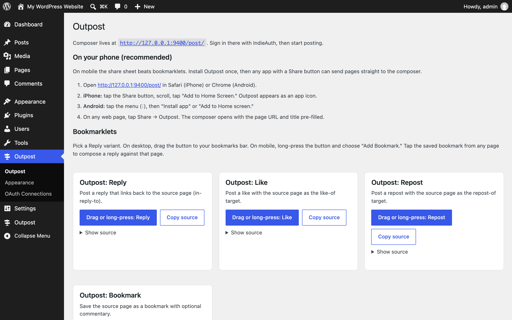

The main **Outpost** admin page: per-variant bookmarklets and the phone install steps. The dependency notice at the top appears when IndieAuth or Micropub isn't active yet. See [Common tasks → Add the bookmarklets](/outpost/common-tasks/).

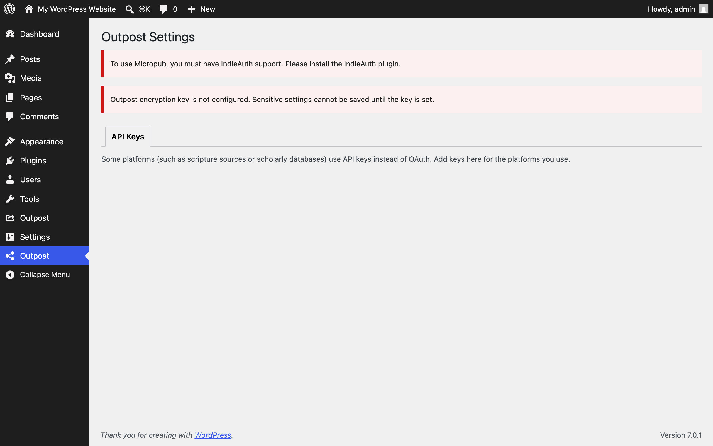

**Outpost Settings → API Keys**: where syndication destination credentials go. Saved values are stored encrypted. See [Settings](/outpost/settings/).

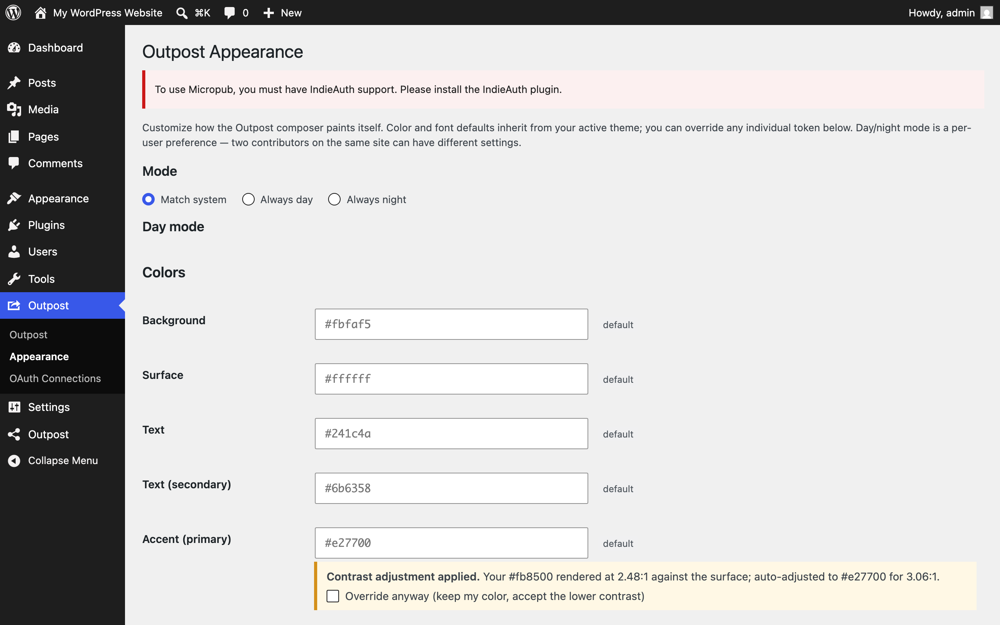

**Outpost → Appearance**: choose the composer's day/night mode and override its design tokens. See [Settings](/outpost/settings/).

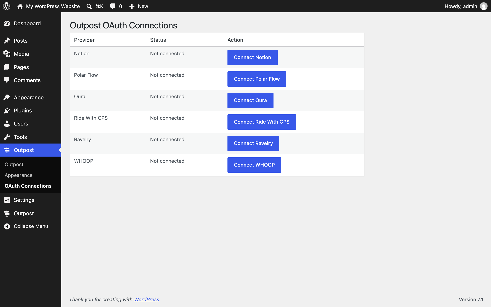

**Outpost → OAuth Connections**: connect Oura, WHOOP, Polar Flow, Ravelry, or Ride With GPS. Select **Connect** next to a provider to start its authorization flow. See [Supported services](/outpost/supported-services/).

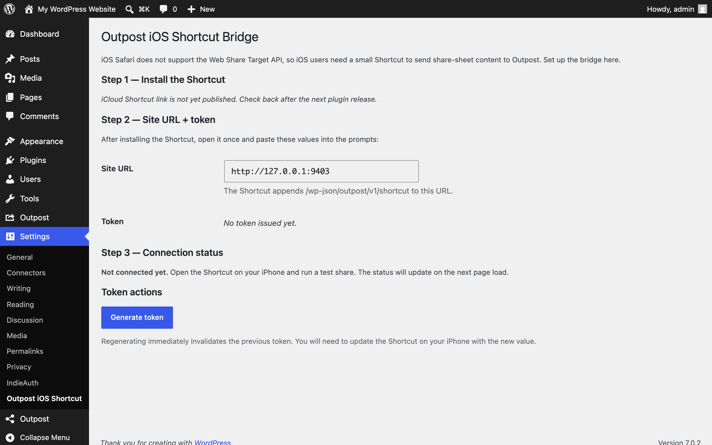

**Settings → Outpost iOS Shortcut**: generate the per-user token that lets an iOS Shortcut post to your site. See [Common tasks](/outpost/common-tasks/).

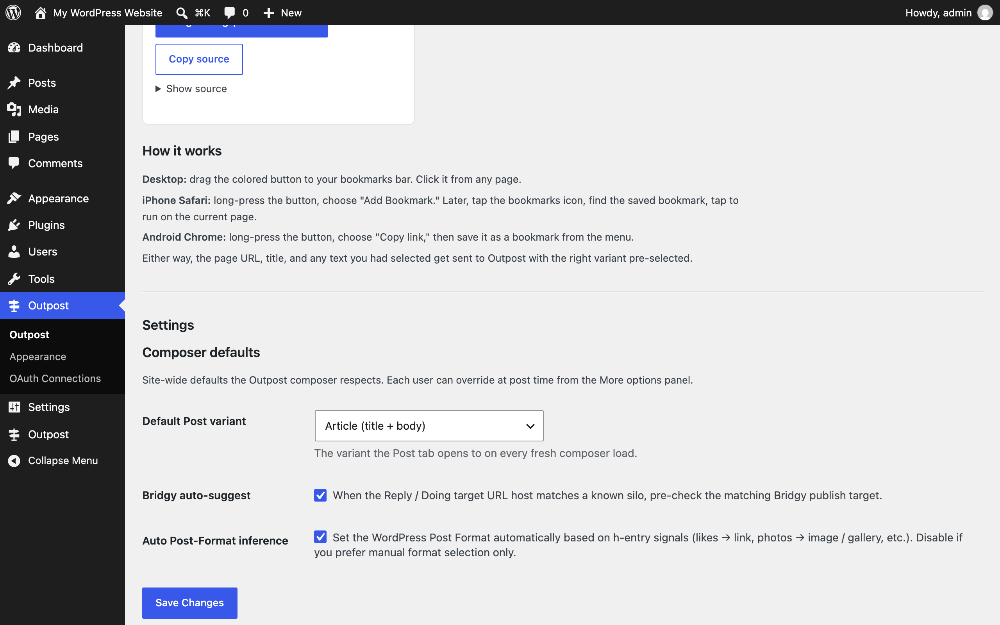

**Outpost admin page, Settings section**: set which mode the composer opens to by default. See [Settings](/outpost/settings/).

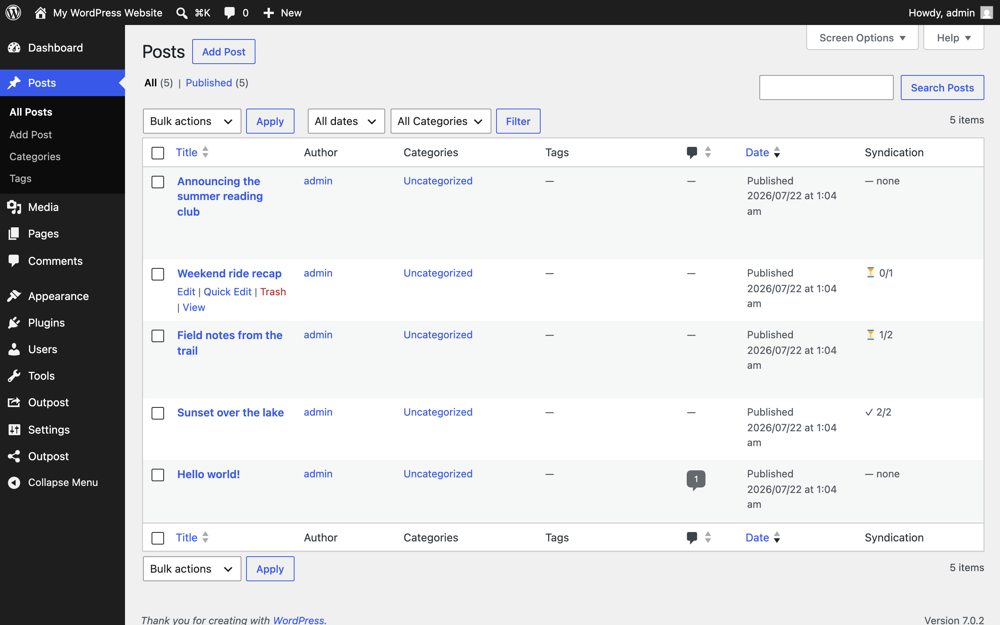

**wp-admin → Posts** with the Outpost syndication status column: confirm where each post syndicated at a glance. See [Common tasks](/outpost/common-tasks/).

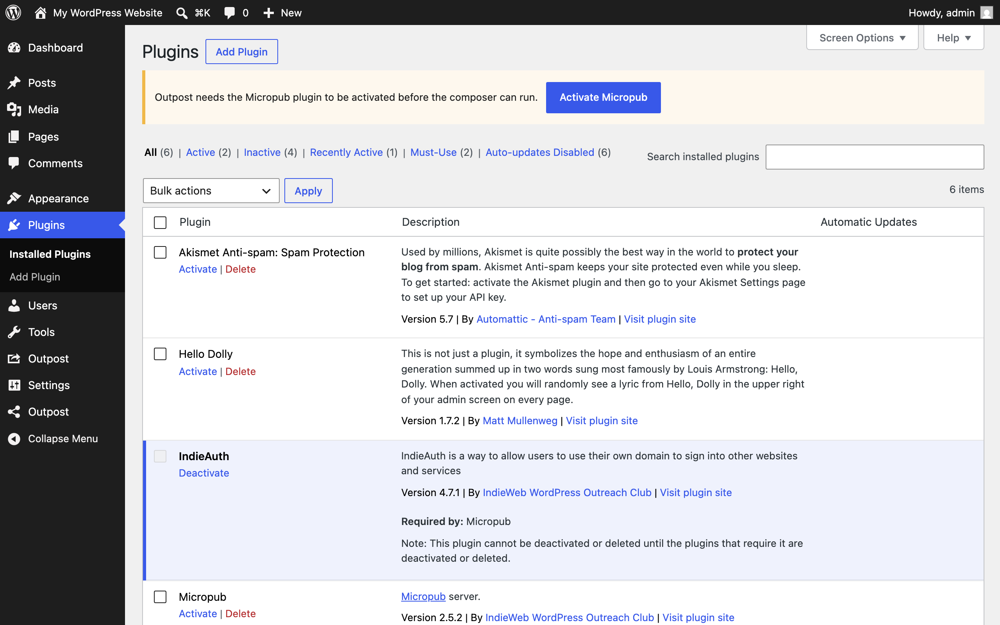

The dependency notice when Micropub is deactivated: Outpost names the missing plugin and links the fix. See [Installation](/outpost/installation/).

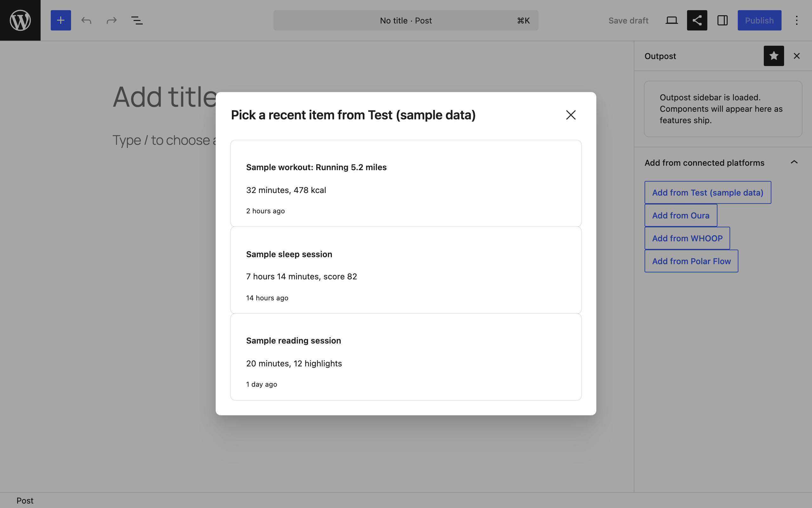

The Outpost sidebar in the block editor: **Add from connected platforms** opens a picker of your recent activity so you can pull a workout, sleep, or reading session into the post you're writing. The capture uses the built-in sample provider; with Oura, WHOOP, or Polar Flow connected, those appear alongside it. See [Supported services](/outpost/supported-services/).

## Composer

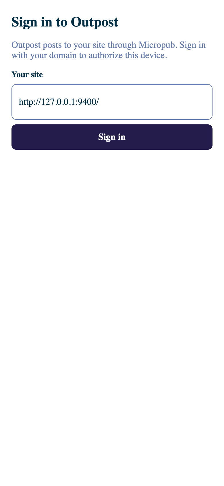

The composer at `/post` before sign-in: enter your site address to start the IndieAuth flow. See [Getting started](/outpost/getting-started/).

Note mode, signed in: write a note and pick syndication targets before posting. See [Common tasks](/outpost/common-tasks/).

Reply mode: paste a URL and Outpost shows what you're replying to. See [Common tasks](/outpost/common-tasks/).

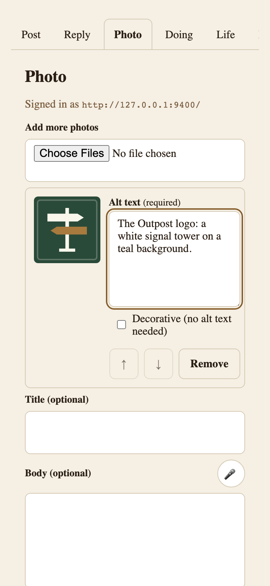

Photo mode: every photo post asks for alt text before publishing. See [Common tasks](/outpost/common-tasks/).

The composer offline: posts made offline wait in the queue until you reconnect. See [Common tasks](/outpost/common-tasks/).

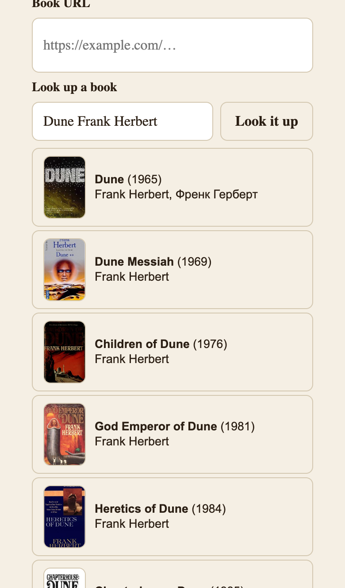

Doing mode, Read variant: **Look it up** fills the details so you don't type them. Results come from the lookup services the Post Kinds companion provides — books from Open Library here. See [Common tasks → Log what you're reading](/outpost/common-tasks/).

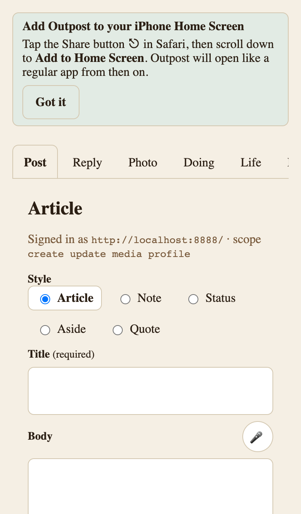

Install the composer like an app. After your first post, Outpost offers the Add to Home Screen step for your browser — on iPhone it points at Safari's Share button; on Android it triggers the browser's own install prompt. See [Getting started](/outpost/getting-started/).

## Screenshots still needed

One capture remains. The row below is its full specification (viewport 1280×800 at 2x for admin screens, a phone-sized viewport for composer screens).

| Filename | Screen and state | What to highlight | Alt text | Caption |
| --- | --- | --- | --- | --- |
| admin-pending-syndication-capture.png | Pending-syndication reminder flow | The paste-URL field | Prompt asking whether the post was shared, with a field to paste the URL | Record the URL after sharing manually to a platform. |

Why it stays manual: neither surface for this flow is reachable today. The composer-side capture form (`SyndicationCaptureForm`, inside `SyndicationDetailView`) is built and tested but nothing mounts it, so it doesn't render anywhere in the running app. The admin-side reminder (`Outpost_Pending_Syndication_Notice`) does emit its markup on the post editor screen, but WordPress places `admin_notices` output inside the block editor's no-JS fallback container, which is hidden whenever the editor loads — so nobody using the block editor ever sees it. Verified 2026-08-21 against WordPress 7.0 with a post carrying two pending entries: the detector returns them and the markup is present, with a computed height of 0 inside a `display: none` parent. That's tracked as a bug to fix before this screenshot can be taken honestly.
