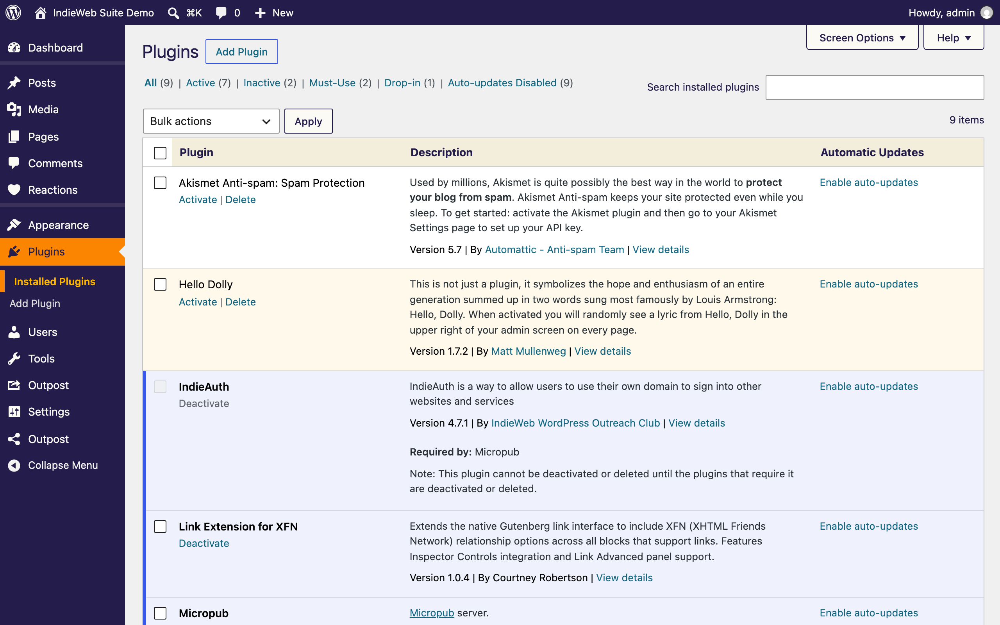
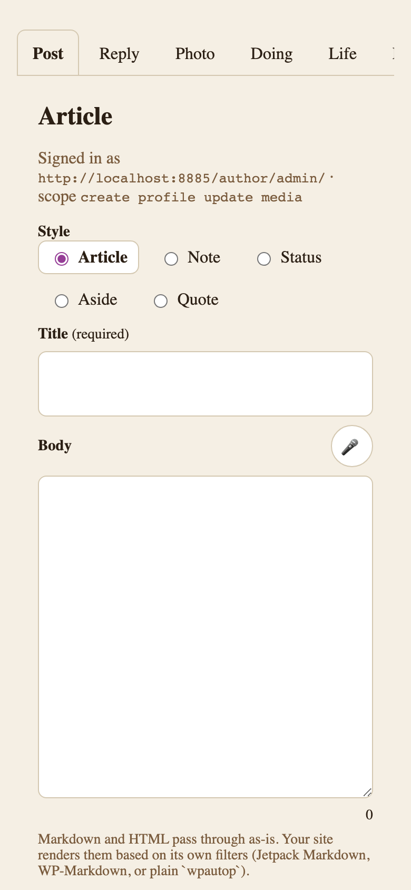
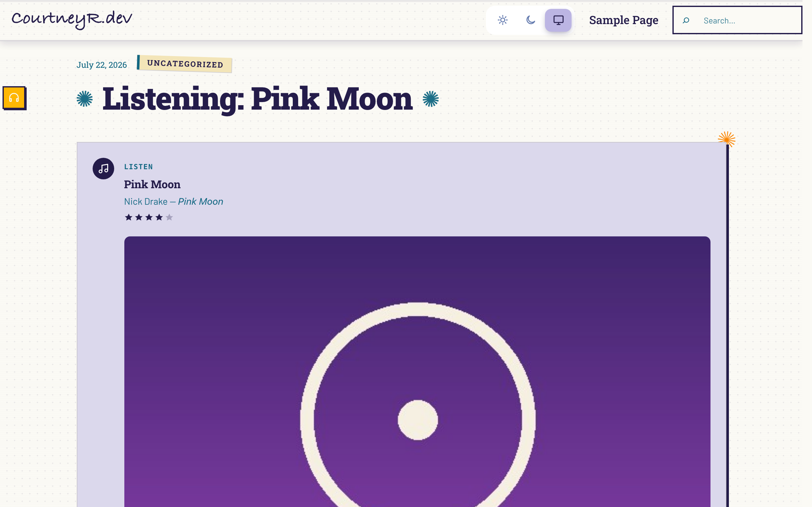
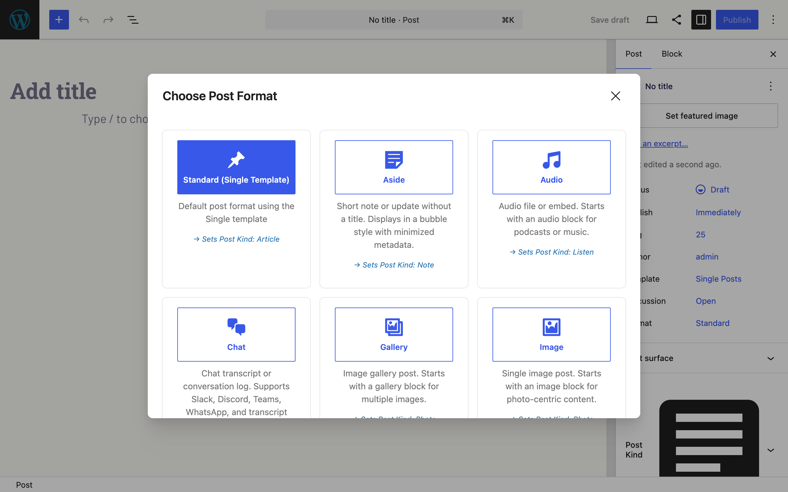

Outpost is built to sit at the center of a small suite of IndieWeb plugins: [Post Kinds for IndieWeb in Block Themes](https://courtneyr-dev.github.io/post-kinds-for-indieweb/), [Post Formats for Block Themes](https://courtneyr-dev.github.io/post-formats-for-block-themes/), and [Link Extension for XFN](https://courtneyr-dev.github.io/link-extension-for-xfn/). Outpost detects companions at runtime — activate one and the composer grows the matching capability, deactivate it and the composer quietly narrows. None of them is required.

The screenshots on this page come from a demo site running the whole suite with a styled block theme (plus the IndieAuth, Micropub, and Webmention building blocks), so they show a real site's look rather than a default install.

## The full stack on one site

The suite plus its building blocks: IndieAuth signs you in, Micropub receives what the composer publishes, Webmention handles responses, and the three companion plugins shape how posts are written and displayed.

## Compose on your phone

The composer signed in against the demo site over IndieAuth. With Post Kinds active, the tab row grows the Listen/Watch/Read/Checkin group; with Post Formats active, the style you pick flows into format inference once the post lands.

## What arrives on your site

A listen logged from the composer renders as a Post Kinds Listen Card in the theme's own styling — cover art, rating, and microformats included. With Webmention active the post also grows a likes-and-reposts section and a reply form.

## Formats and kinds stay in step

Editing on the desktop side, Post Formats' selection modal shows the kind mapping Post Kinds registers — **Standard → Article**, **Aside → Note**, **Audio → Listen**. Posts published from Outpost pass through the same mapping, so a note from your phone and a note from the editor end up shaped identically.

## What each plugin adds

- **Outpost** — this plugin: the phone-friendly composer, syndication chips, offline queue, and share-sheet capture.
- **Post Kinds for IndieWeb** — card blocks and microformats for the kind-shaped posts the composer creates.
- **Post Formats for Block Themes** — format patterns, badges, and templates; formats map onto kinds automatically.
- **Link Extension for XFN** — relationship attributes on links in any post, including reply targets.
